<h1 align='center'>Clipadvisor Web Application</h1>

Code Institute Diploma in Software Development: Python and Data-Centric Development - Milestone Project

<a href="https://clipadvisor-flask-app.herokuapp.com/" style="font-weight:bold;">Live link to deployed project</a> (hosted on GitHub Pages)

---

**Clipadvisor** is a full-stack web application that boasts comprehensive CRUD functionality, allowing users to post, view, edit and delete reviews of barbers. Backend data processing is facilitated by Python+Flask in tandem with SQLAlchemy (via the Flask-SQLAlchemy extension). Dynamic templating logic has been put in place to enable visitors to navigate with ease and choose from an appropriate selection of frontend pages (routes), depending on whether they are logged in or out. The site offers a highly rewarding User Experience through the use of carefully-targetted colour schemes, fully-responsive design flourishes and smart interactivity. Overall, it comfortably fulfills its goal of being "a cut above" its competitors!

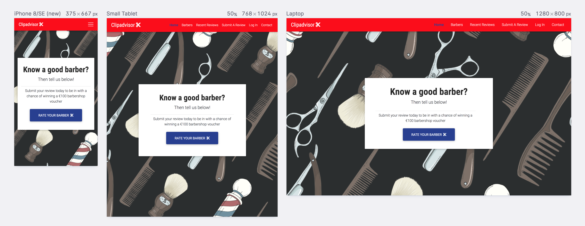

## User Experience (UX)

As we emerge from Level-5 lockdown, and normality slowly returns to the services and retail sectors, the majority of us will be looking forward to getting a long-overdue and much-needed haircut. Given that this set of circumstances will likely result in long waiting lists at barbers everywhere, it would be nice to know which businesses are worth waiting for and which should best be avoided.

That's where Clipadvisor comes in, offering users a convenient, trustworthy and authoritative source of barbershop ratings and reviews.

As with any such application, the best way to showcase Clipadvisor's benefits and features is to profile a number of **User Stories** pertaining to typical visitors to the site. With this in mind, a list of such User Stories might include (but by no means be limited to) the following:

1. "As a first-time user, I would like to be able to CREATE a review of a barber I visited recently."
2. "As a first-time user, I would like to be able to READ reviews of barbers posted previously by others."
3. "As a first-time user, I would like to be able to search for a review(s) of a particular barber I am thinking of visiting."
4. "As a returning user, I would like to be able to UPDATE a review I posted recently."
5. "As a returning user, I would like to be able to DELETE a review I posted recently."
6. "As a Clipadvisor user, I would like to be able to contact the site owner(s) with a query/feature request."
7. "As a developer, I would like to be able to contact the site owner(s) to offer feedback on the app's functionality."
8. "As site owner, I would like to be able to moderate all user-submitted content, i.e. have the ability to UPDATE and/or DELETE reviews where necessary."
9. "As site owner, I would like for users to be able to contact me directly, i.e. without having to leave the application."

On the **Design** front, a [Material Design for Bootstrap](https://mdbootstrap.com/) stylesheet was used to give the site its overall look and feel - more specifically, the [MDB jQuery 3 (default Bootstrap 4 version)](https://mdbootstrap.com/docs/b4/jquery/) was chosen for this purpose.

The traditional 'barbers pole' **colours** of red, blue and white are employed throughout. The particular shades of red and blue (given the class names `.barber-red` and `.barber-blue`, respectively, in the site's custom stylesheet) are taken from [this Shutterstock 'barber shop icon'](https://www.shutterstock.com/image-vector/barber-symbol-shop-icon-hair-service-1070505362?id=1070505362&irclickid=1jiSOcU5OxyLUmQwUx0Mo3EqUkEXh30ItXjY1M0&irgwc=1&utm_medium=Affiliate&utm_campaign=Free%20SVG&utm_source=2022575&utm_term=&c3ch=Affiliate&c3nid=IR-2022575), and lend visual clarity and consistency to the site.

In terms of **font** preferences, things were kept pretty simple: Roboto was chosen for the vast majority of site text; this is complemented by [Roboto Condensed](https://fonts.google.com/specimen/Roboto+Condensed?query=roboto+conde) for most headings, as well as for the `.navbar-brand` Clipadvisor logo element.

From the perspective of **imagery**, the site's background hero image (a hand-drawn sketch featuring a variety of barbershop utensils) is a stock illustration [taken from Shutterstock's library](https://www.shutterstock.com/image-illustration/barber-shop-seamless-pattern-hand-drawn-1715625478). The aforementioned ['barbers pole' icon](https://www.shutterstock.com/image-vector/barber-symbol-shop-icon-hair-service-1070505362?id=1070505362&irclickid=1jiSOcU5OxyLUmQwUx0Mo3EqUkEXh30ItXjY1M0&irgwc=1&utm_medium=Affiliate&utm_campaign=Free%20SVG&utm_source=2022575&utm_term=&c3ch=Affiliate&c3nid=IR-2022575), used for the site's favicon as well as to accompany most of the main headings, is also used with permission from Shutterstock. All other icons are imported from [Font Awesome](https://fontawesome.com/).

All pre-existing site content (user profiles, barbershop names, reviews etc.) at the time of writing is purely generic filler text compiled by the site's creator for the sake of authenticity.

## Features

### Navigation

- The site boasts a dynamically-generated `.navbar` (collapsed on mobile devices) that is displayed across the top of each page and responds to whether the user happens to be logged in or not at any given time:

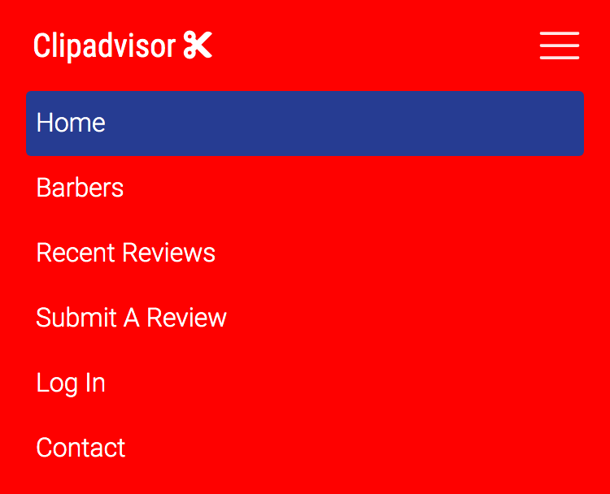

### Main landing (Home) page:

- Visitors are greeted by an eye-catching `.jumbotron` message encouraging them to contribute a review by clicking on the blue and white 'call-to-action' `button`:

- Assuming that the user _is not_ already logged-in, clicking on this `button` will bring them to the site's registration page. Here, they can either:
  - fill out and submit a short form in order to create their profile (a requirement for posting reviews)
  or
  - click instead on the login `button` beneath the registration form, which will bring them to the login page where they can enter their previously-registered email and password in order to log in
  - In either case, they will then be redirected to a page where they can compose and submit a review (a dismissible Flash welcome message - styled using Bootstrap's `.alert` classes - will appear between the main `.navbar` and the 'Rate your barber!' heading at the top of the `form` when they first arrive on this page):

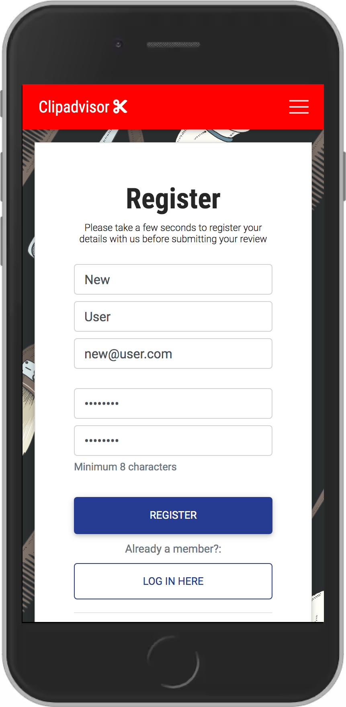
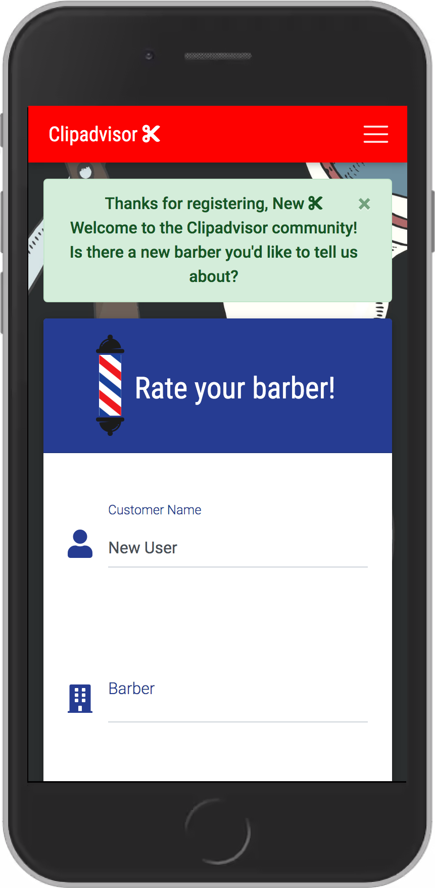

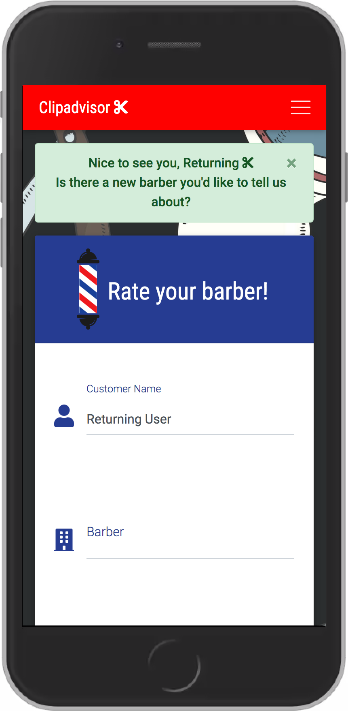

- If, on the other hand, the user _is_ already logged-in, then clicking on the landing page's CTA `button` will take them directly to this review submission form (minus any Flash messaging, as this is seen as being redundant here):

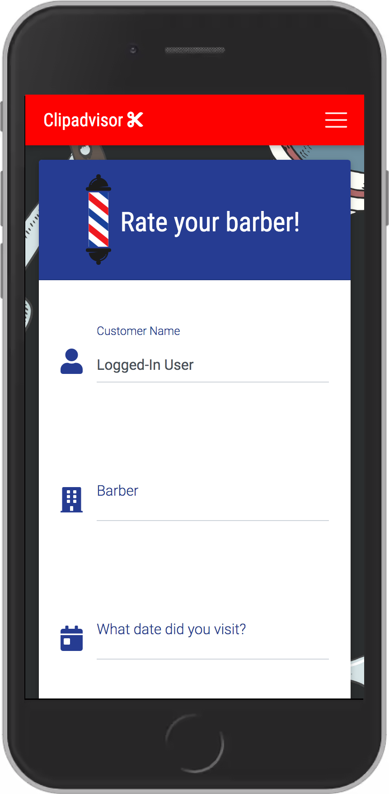

### Login page

- The login link in the site's main `.navbar` simply brings the user to the login page illustrated above. If they're not already registered at this point, they will have to do so by leaving the login page via the 'Register Here' button at the foot of the login form. This will redirect them to the registration form, where they can enter their details (all `input` fields are once again required)

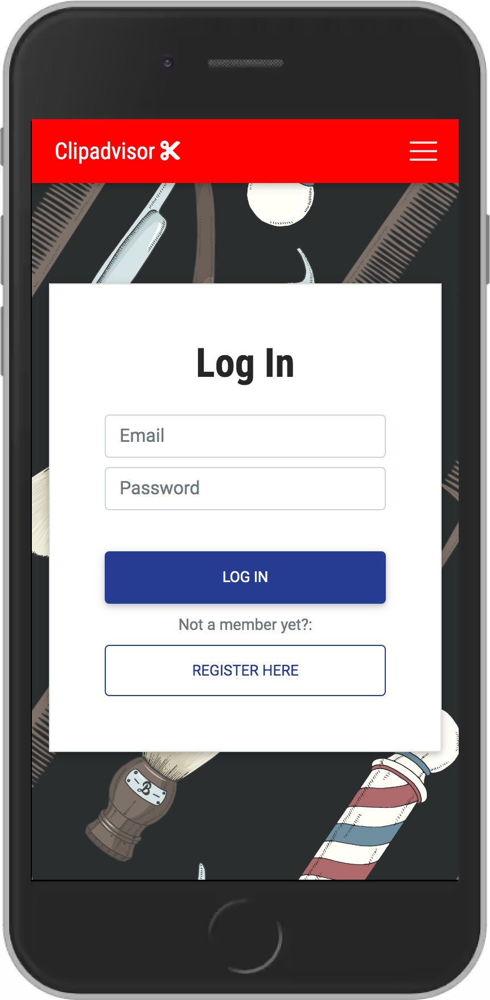
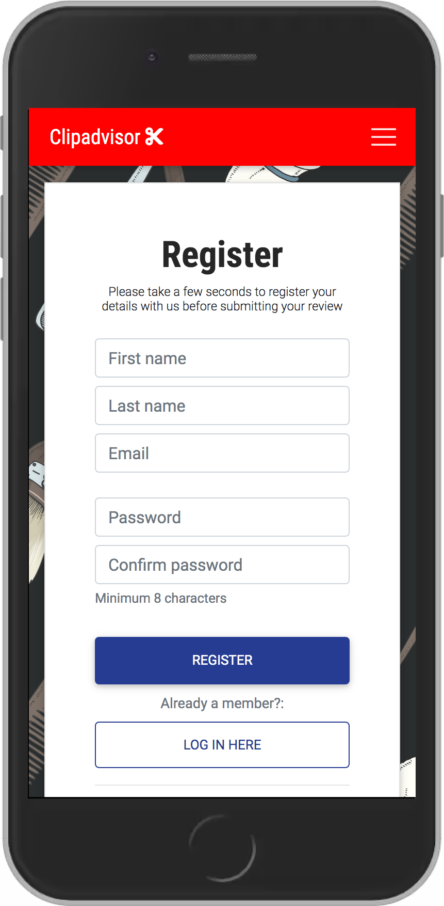

### Barbers page(s)

- The Barbers link in the main `.navbar` leads the user to four interconnected pages, each of which applies a different filter to the list of barbers stored in the site's backend database:

  
  - A compact tabbed interface has been put in place using Bootstrap's `.nav-tabs` class for streamlined sorting of all stored barbershops under a variety of self-explanatory headings:
    - 'All Barbers'
    - 'Top-Rated'
    - 'Walk-Ins Welcome'
    - 'Cash Accepted'

  - This is intended to enhance the overall UX by providing (relatively basic) search functionality, in lieu of an actual site-wide search bar (a potential future feature to be added at a later date)

- In addition to this tabbed sorting, a visually-appealing colour scheme has also been applied to the alphabetised list of barbers displayed based on user descriptions: all "cheap & cheerful" barbers are thus given a light green `.card-header` element (etc.)

- Furthermore, when a user clicks on one of these descriptor tags (e.g. 'cheap & cheerful') within the `.card-body` they are brought to a list comprised solely of barbers with that same 'vibe':

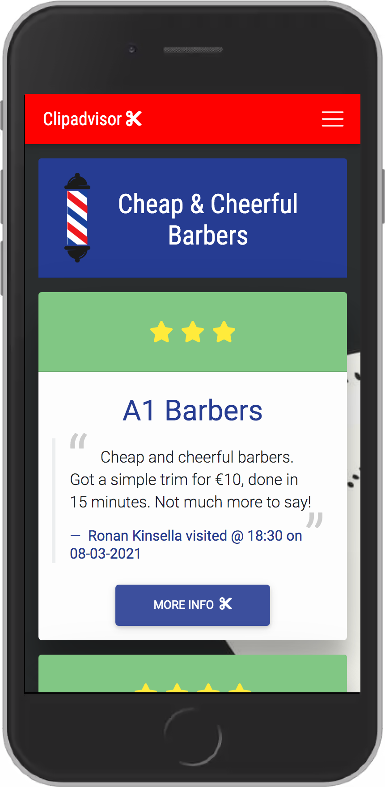

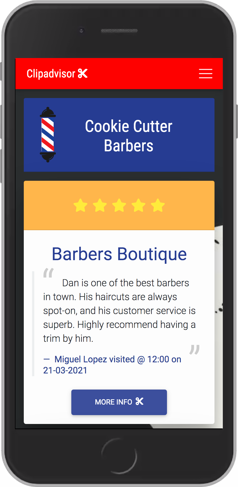

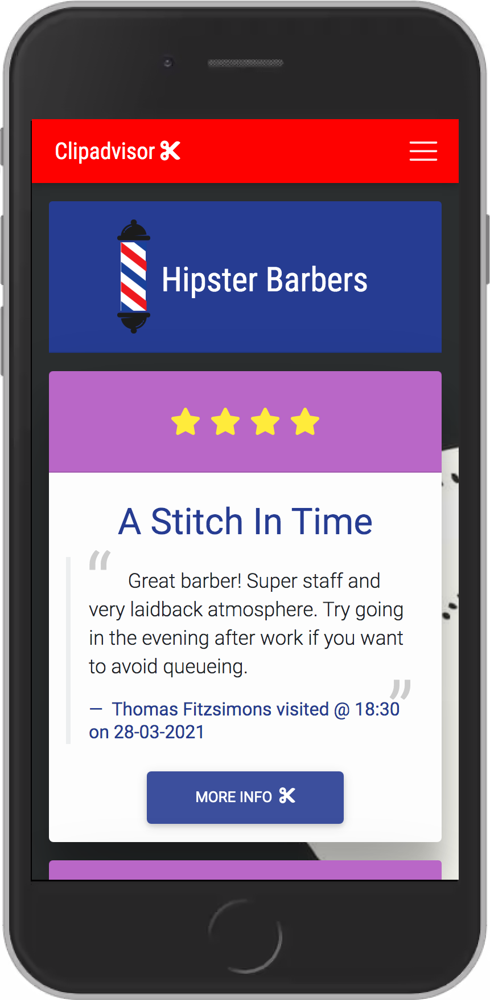

### Recent Reviews page

- The Recent Reviews link in the main `.navbar` brings the user to a list of reviews filtered by recency (with the most recent reviews at the top of this list)
- The colour scheme is the same for all reviews this time, however:

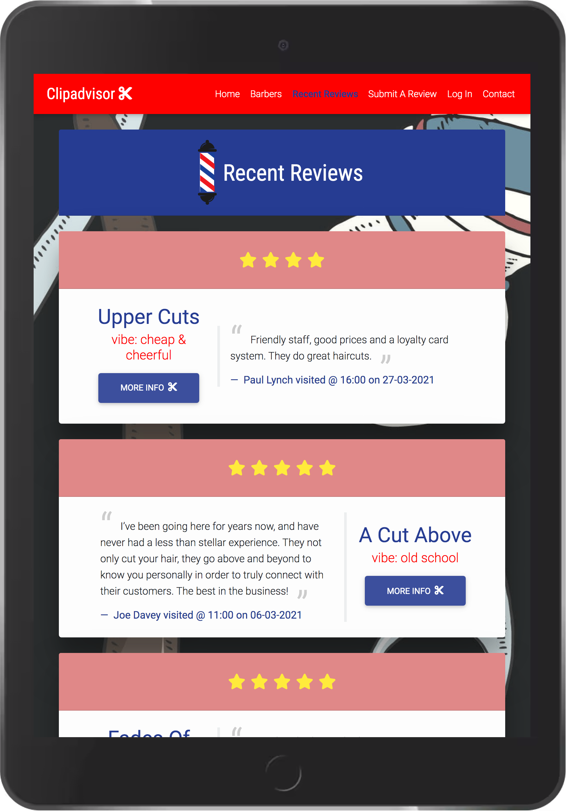

- Clicking on the 'More Info' `button` embedded within the body of each review triggers an informational `.modal` component giving a breakdown of some of the more granular aspects of each barbershop experience:

- Logged-in users will notice that reviews they have previously submitted are displayed in bolder colours that make them stand out
- They will also see two additional buttons attached to each of their submitted reviews allowing them to either **update** or **delete** the review in question (see User Stories for a more thorough explanation of this CRUD functionality)

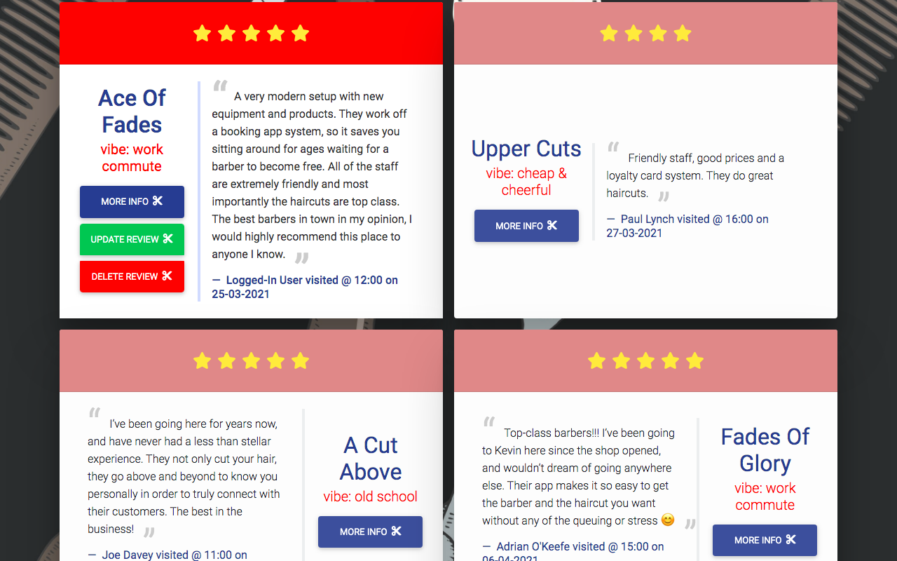

- As with the Barbers page(s) discussed above, pagination has been implemented at the foot of the main reviews UI. The number of reviews displayed per page is capped at ten. Users can navigate both backwards and forwards using custom pagination links.

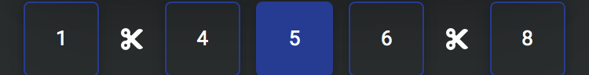

- This pagination functionality was built with help from [this YouTube tutorial](https://www.youtube.com/watch?v=PSWf2TjTGNY)

### Submit A Review page

- Once a user is logged in (see above), they may post a review to the site by completing a `form` element consisting of a total of nine `.form-group` input fields and a submit button. All nine of these fields are required (in the case of both the 'booking options' and 'payment options' fields, a minimum of one checkbox must be selected). A combination of browser default HTML5 `form` validation and both custom client-side and server-side validation prevents users from submitting incomplete forms.

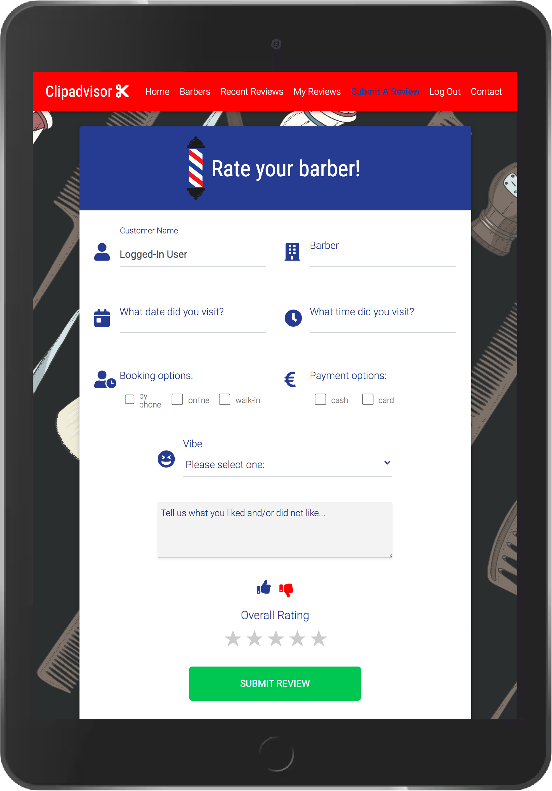

- When they have successfully completed and submitted this form, the user is redirected to the Recent Reviews page (see above), where they will see their posted review at the top of the page. There will also be a dismissible Flash messaging alert box right below the main `.navbar` thanking them for contributing to Clipadvisor.

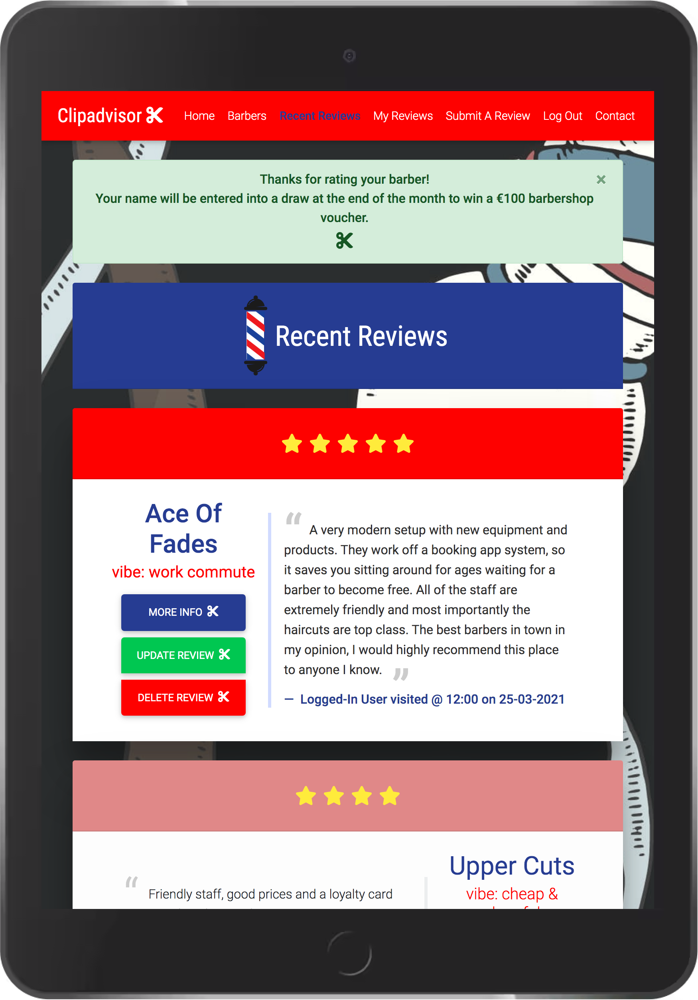

### My Reviews page

- A logged-in user can find all of their submitted reviews together in one place by clicking on the 'My Reviews' link in the main `.navbar`. Much like its parent 'Recent Reviews' page, this personalised page displays the user's reviews in reverse chronological order (most recent reviews at the top). The user can also avail of full update and delete functionality here by using the corresponding buttons (as outlined above):

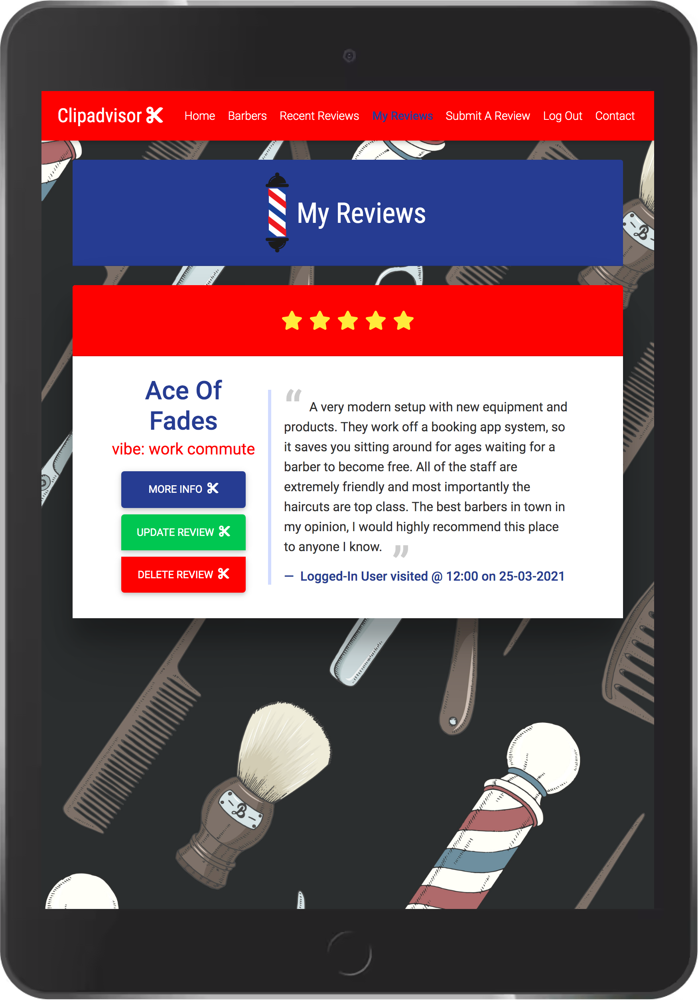

### Contact page

- It's easy for users to contact the site owner, regardless of whether they happen to be logged-in regular visitors or first-time guests. Selecting the Contact link in the main `.navbar` brings them to a user-friendly contact form, where they are asked to fill in the details of their request/query/feedback. If the user _is_ logged in at this point, they are not asked to provide their email address, as this will already be stored in the current session's cookie data. Logged-out users, on the other hand, will have to provide an email address in order to submit the contact form (whose `input` fields are once again all required).

- Assuming everything is in order and all `form` fields have been completed, the user is briefly redirected to a page thanking them for getting in touch and assuring them that someone from Clipadvisor will respond to their request/query/feedback in due course. A simple JavaScript timeout function has been set on this page which then returns the user to the site's Home page after five seconds.

### Logging out

- Logged-in users can log out of the site at any time by clicking the Log Out link in the main `.navbar`. In a similar vein as the post-submission redirect functionality applied to the Contact page, as soon as a user logs out they are briefly taken to a holding screen where their logout is confirmed and they are thanked for being a part of Clipadvisor. This is swiftly followed (again, after five seconds) by a second redirect that returns them to the site's Home page.

### Wireframes

- [mobile](docs/wireframes/clipadvisor_mobile.pdf)
- [tablet](docs/wireframes/clipadvisor_tablet.pdf)
- [desktop](docs/wireframes/clipadvisor_desktop.pdf)

## Technologies Used

### Languages

- [HTML5](https://en.wikipedia.org/wiki/HTML5)
- [CSS3](https://en.wikipedia.org/wiki/CSS)
- [JavaScript](https://en.wikipedia.org/wiki/JavaScript)
- [Python 3](https://en.wikipedia.org/wiki/Python_(programming_language))

### Frameworks, Libraries, Programmes, Toolkits & Engines

- [Bootstrap](https://getbootstrap.com/) [(v4.5.0)](https://cdnjs.cloudflare.com/ajax/libs/twitter-bootstrap/4.5.0/js/bootstrap.min.js)
- [Material Design for Bootstrap 4](https://mdbootstrap.com/docs/b4/jquery/) [v4.19.1](https://cdnjs.com/libraries/mdbootstrap/4.19.1)
- [jQuery](https://jquery.com/) [(v3.5.1)](https://cdnjs.cloudflare.com/ajax/libs/jquery/3.5.1/jquery.min.js)
- [Google Fonts](https://fonts.google.com/)
- [Font Awesome](https://fontawesome.com/)
- [Popper.js](https://popper.js.org/)
- [jQuery DateTimePicker plugin](https://xdsoft.net/jqplugins/datetimepicker/)
- [Flask](https://palletsprojects.com/p/flask/)
- [SQLAlchemy](https://www.sqlalchemy.org/)
- [Jinja](https://palletsprojects.com/p/jinja/)

## Testing

- All testing was performed manually, and on a near-constant basis as the project evolved. [Google Chrome DevTools](https://developers.google.com/web/tools/chrome-devtools/?utm_source=dcc&utm_medium=redirect&utm_campaign=2018Q2) served as an indispensable resource throughout this testing process, allowing incremental adjustments to be made to the site's infrastructure and layout. The site's responsiveness was also closely monitored and rigorously tested from start to finish using the bespoke developer-oriented [Polypane browser](https://t.co/XxyDrRbRdl?amp=1).

- In addition to Chrome and Polypane, the site's functionality and appearance was also checked repeatedly in the Firefox, Safari, Microsoft Edge and Amazon Silk browsers. Numerous devices and screen sizes - belonging mostly to friends and family members - were similarly used to identify any blind spots in the site's responsive design and feature compatibility. These included the Samsung Galaxy S5, iPhone 7 Plus, Moto G4, Huawei P20, MacBook Pro, iPad and Kindle Fire.

- [W3C](https://www.w3.org/)'s [Markup Validation Service](https://validator.w3.org/) was used to test the validity of all HTML used in this project. The code was [validated by direct input](https://validator.w3.org/#validate_by_input), and all suggested corrections were then made. As a result, all of the site's HTML source documents (with Jinja templating snippets removed) now return a _"Document checking completed. No errors or warnings to show."_ message upon being passed through this validator, as is reflected in the following sample screenshots:
  - [base.html validation](docs/images/validation/html-validation1.png)
  - [index.html validation](docs/images/validation/html-validation2.png)
  - [login.html validation](docs/images/validation/html-validation3.png)
  - [register.html validation](docs/images/validation/html-validation4.png)
  - [logout.html validation](docs/images/validation/html-validation5.png)
  - [review-submit.html validation](docs/images/validation/html-validation6.png)
  - [contact.html validation](docs/images/validation/html-validation7.png)
  - [thank-you.html validation](docs/images/validation/html-validation8.png)
  - [errors/403.html validation](docs/images/validation/html-validation9.png)
  - [errors/404.html validation](docs/images/validation/html-validation10.png)
  - [errors/500.html validation](docs/images/validation/html-validation11.png)

  

- Likewise, the website's custom CSS stylesheet was checked for errors using [W3C](https://www.w3.org/)'s [CSS Validation Service](https://jigsaw.w3.org/css-validator/). Once again, [validation by direct input](https://jigsaw.w3.org/css-validator/#validate_by_input) was the preferred method selected, and all necessary changes were subsequently carried out. Consequently, the stylesheet now returns a _"Congratulations! No error found."_ message upon being passed through this validator, as the following screenshot indicates:
  - [css/style.css validation](docs/images/validation/css-validation.png)

  

- In a similar manner, both custom JavaScript files were validated against [JSHint](https://jshint.com/)'s error-detection tool, which is available both as an online linter and a Gitpod/VS Code extension for real-time JS problem-solving. The screenshots below show that, after heeding various warning and error messages, at the time of deployment both .js documents passed JSHint validation with no problems detected:
  - [js/script.js validation](docs/images/validation/js-validation1.png)
  - [js/redirect.js validation](docs/images/validation/js-validation2.png)

  

- Yet another [validation tool](http://pep8online.com/) was used to ensure that all of the project's Python source code is [Pep 8-compliant](https://legacy.python.org/dev/peps/pep-0008/). This checking was done by simply copying and pasting the contents of both the `models.py` and `app.py` files into the relevant field and clicking on 'Check code'. Initially a number of non-compliance errors were returned; these were mostly in the form of "E501: line too long" messages. After making all necessary modifications, the Python code now passes through this validator without issues:
  - [models.py validation](docs/images/validation/python-validation1.png)
  - [app.py validation](docs/images/validation/python-validation2.png)

  

- Returning to the previously-outlined User Stories, each user objective was carefully deconstructed in order to verify that all of the following outcomes can be said to hold true:

1. **"As a first-time user, I would like to be able to CREATE a review of a barber I visited recently."**
  - "Posting a review on Clipadvisor was both simple and straightforward:
    - I first of all clicked on the blue 'RATE YOUR BARBER' button on the Home page.
    - This brought me to a registration form, where I was asked to provide my first name, last name, email address and password in order to register. I was also asked to confirm my password by entering it a second time. Some helpful text just below the form's password fields informed me that my password must be at least 8 characters long.
    - After filling out the form and clicking on the blue 'REGISTER' button, I was brought directly to another form bearing the heading 'Rate your barber!'. This was accompanied by a personalised welcome message at the top of the page thanking me for registering and asking me if there was a barber I would like to review. The form itself consisted of a total of nine fields and a submit button. The first two of these asked me for my name (I noticed that my full name was already entered here) as well as the name of the barber. The next two asked me about the date and time of my haircut: clicking inside the date field loaded a date-picker, while clicking inside the time field loaded a time-picker. These were followed by two checkbox fields: one asking about what booking options were available (three choices in total), the other about the payment options (two choices). Next came a select menu asking me to pick a 'vibe' that best described my barber from a list of eight pre-defined options. Then there was a comment box asking me to tell them what I liked and/or did not like about the experience. Finally, a star rating scale asked me to choose from between one and five stars by way of leaving an overall 'score' for my barber. It took less than two minutes for me to complete the form, and I found all fields to be functional and user-friendly.
    - Once I had finished filling out this form, I clicked on the bright green 'SUBMIT REVIEW' button, which redirected me to a page entitled 'Recent Reviews'. There I was greeted by a message thanking me for my review and informing me that my name would be entered into a draw to win a barbershop voucher at the end of the month (a promotion I had previously seen mentioned on the Home page). I noticed the review I had just posted was listed at the top of the page, and that it stood out from the rest of the reviews due to its bolder, brighter colouring. Some of the information pertaining to my review was stored in a hidden panel that could be accessed by clicking on a blue 'MORE INFO' button below the main body of the review. Two more buttons were located below this blue button: one (green) for updating my review, the other (red) for deleting it."

    
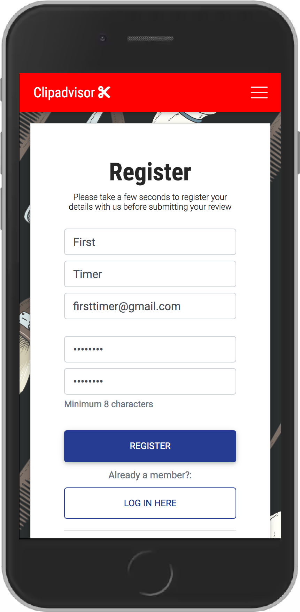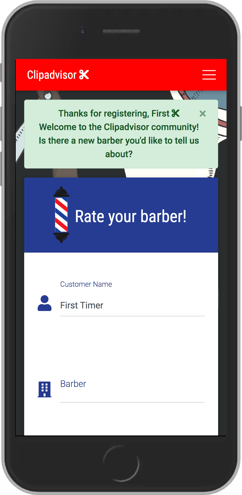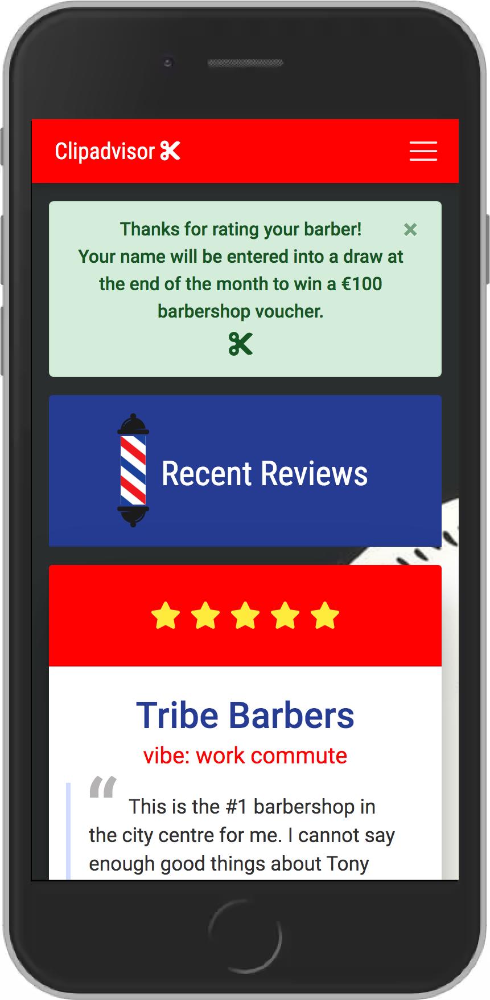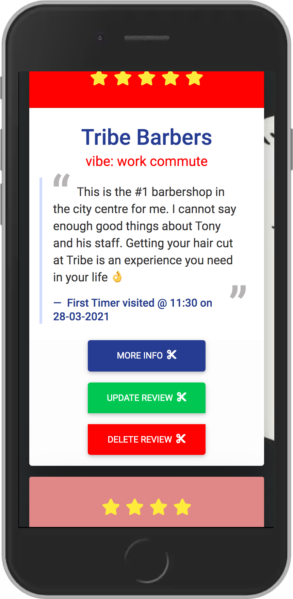

2. **"As a first-time user, I would like to be able to READ reviews of barbers posted previously by others."**
  - "Looking at the main Clipadvisor navigation bar along the top of the page, I noticed a 'Recent Reviews' link.
  - As expected, clicking on this brought me to a section of the site displaying recent reviews of barbers.
  - Scrolling down, I saw that this section was conveniently subdivided into numbered pages using a pagination component.
  - Each page contained a maximum of ten reviews, which made the section easier to digest and navigate.
  - The pagination links also meant that I could scroll through the various pages without having to use any browser navigation buttons."

  
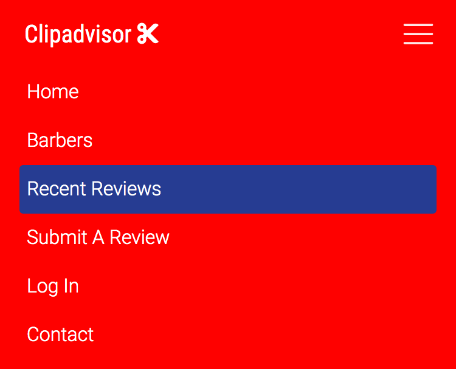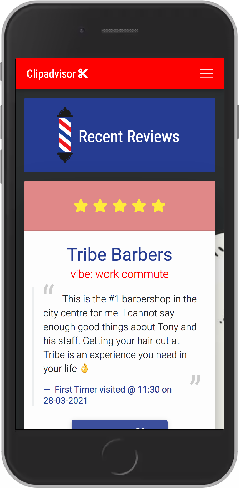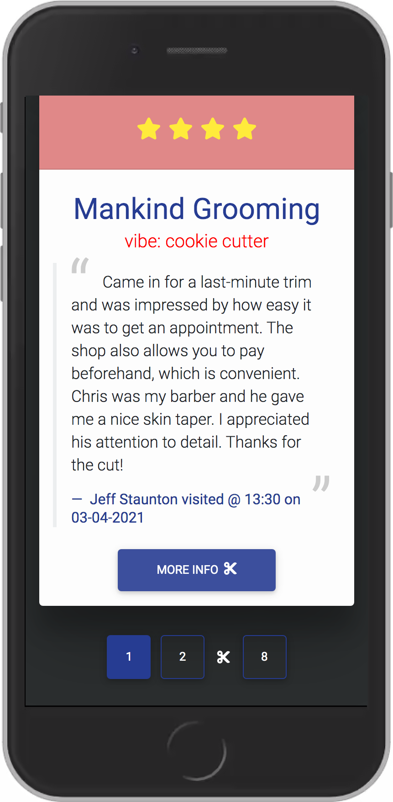

3. **"As a first-time user, I would like to be able to search for a review(s) of a particular barber I am thinking of visiting."**
  - "Looking at the main Clipadvisor navigation bar along the top of the page, I noticed a 'Barbers' link.
  - As expected, clicking on this brought me to a section of the site displaying various barbers that had been reviewed by Clipadvisor users.
  - Scrolling down, I could see that the barbers were listed in alphabetical order, making it easy enough to search for the barber I wanted, and that each page contained a maximum of ten barbers.
  - Navigating to page 3 of this list of all barbers, I quickly found the barber I had been looking for (Fade Room), and discovered a total of five reviews of it.
  - The ratings and comments were overwhelmingly positive, which persuaded me to give them a call and ultimately book in for a haircut."

  
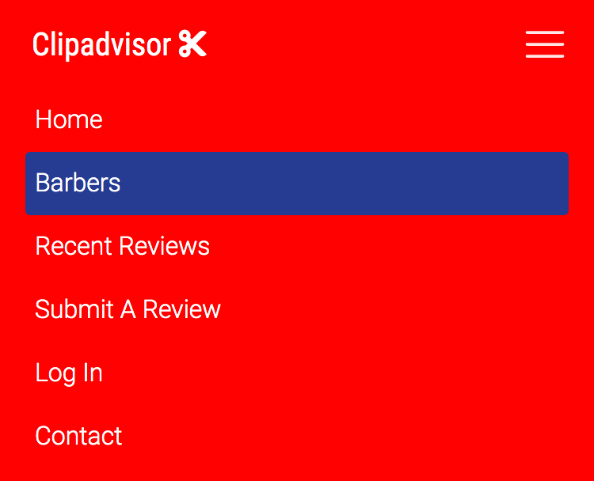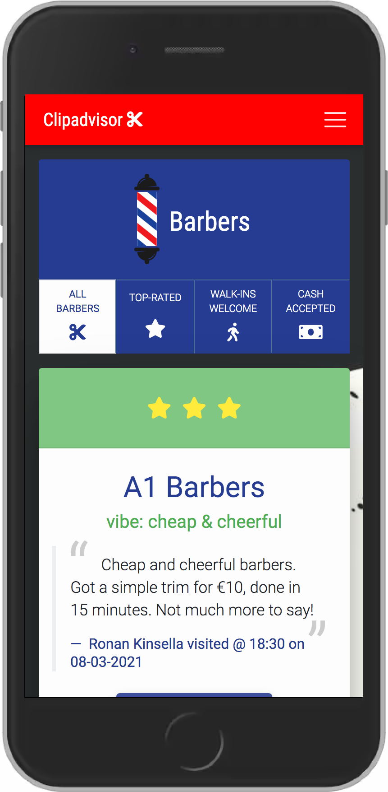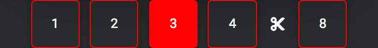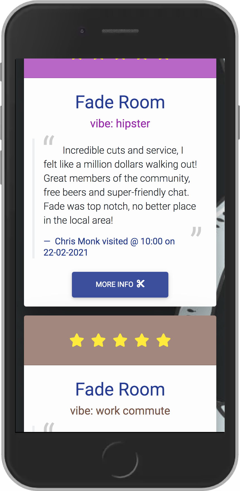

4. **"As a returning user, I would like to be able to UPDATE a review I posted recently."**
  - "Clicking on the 'Log In' link in the main Clipadvisor navigation bar brought me to the login page, where I entered my email address and password.
  - Having entered these, I clicked on the blue 'LOG IN' button, which brought me to a page with a 'Rate your barber!' form, together with a prompt for me to submit a review. 
  - Instead, I navigated to the 'My Reviews' page (again via a link in the site's main nav bar), where I found my one and only submitted review.
  - Clicking on the bright green 'UPDATE REVIEW' button loaded a copy of my original review in a form bearing the title 'Update your review!'. There was also a helpful message reminding me to click on the 'UPDATE REVIEW' button at the bottom of the form in order to save my changes. 
  - I duly edited my review - downgrading it from a five-star to a four-star 'Overall Rating' - and clicked the button as instructed.
  - This brought me back to the 'Recent Reviews' section, where I could see my updated review in bold."

  
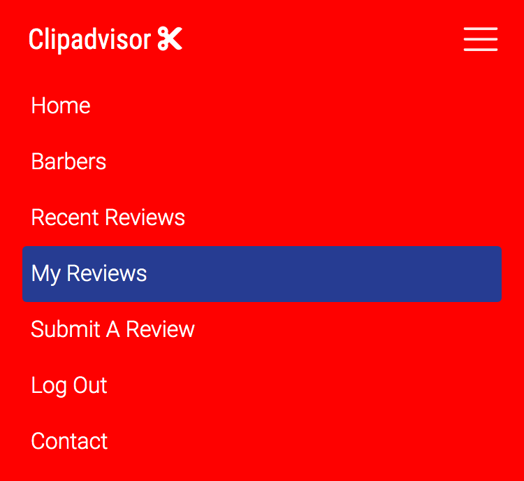

  
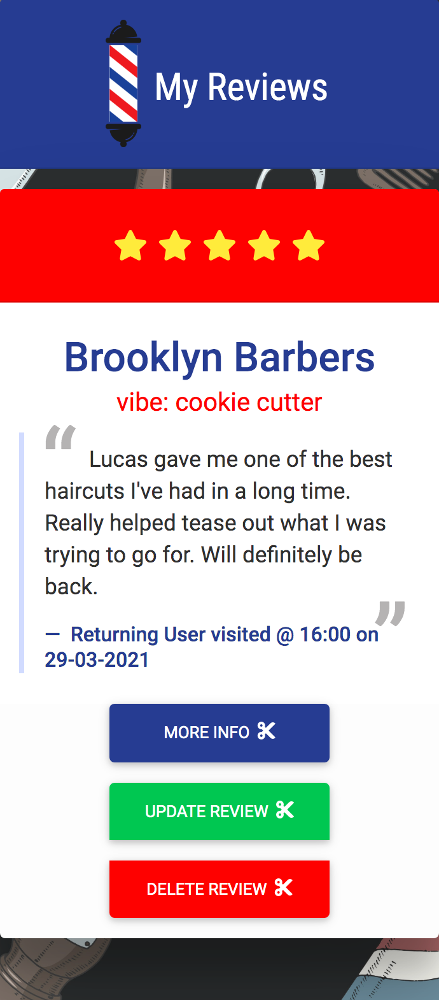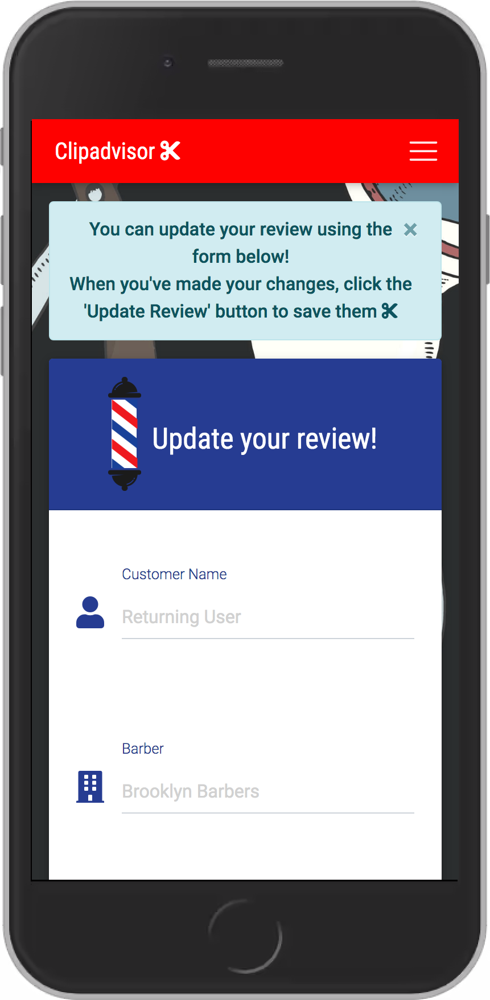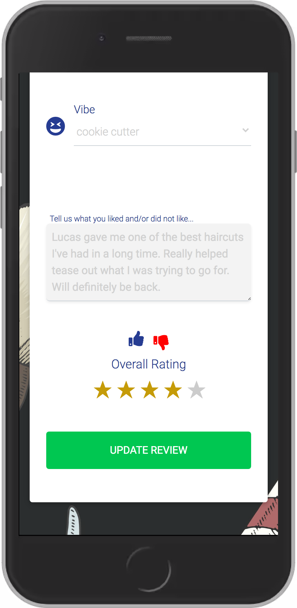

5. **"As a returning user, I would like to be able to DELETE a review I posted recently."**
  - "Clicking on the 'Log In' link in the main Clipadvisor navigation bar brought me to the login page, where I entered my email address and password.
  - Having entered these, I clicked on the blue 'LOG IN' button, which brought me to a page with a 'Rate your barber!' form, together with a prompt for me to submit a review. 
  - Instead, I navigated to the 'My Reviews' page (again via a link in the site's main nav bar), where I found my one and only submitted review.
  - Clicking on the bright red 'DELETE REVIEW' button triggered a confirmation message asking me if I was sure I wanted to delete my review. 
  - I selected 'YES', which then brought me back to the 'Recent Reviews' section, where I could see a "Review deleted successfully!" notification at the top of the page.
  - To verify that my review had in fact been deleted, I navigated once more to the 'My Reviews' page via the corresponding link in the main nav bar.
  - This time, instead of seeing my review(s) I was greeted by a message explaining that I had no reviews to show and prompting me to submit a review by clicking on a blue 'RATE YOUR BARBER' button."

  
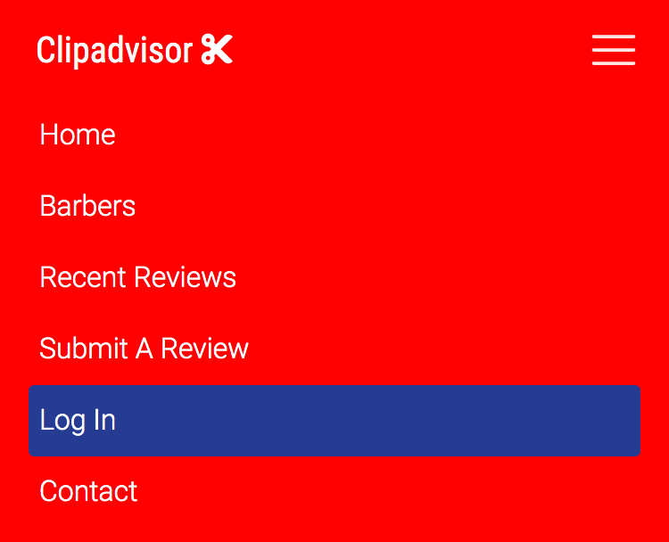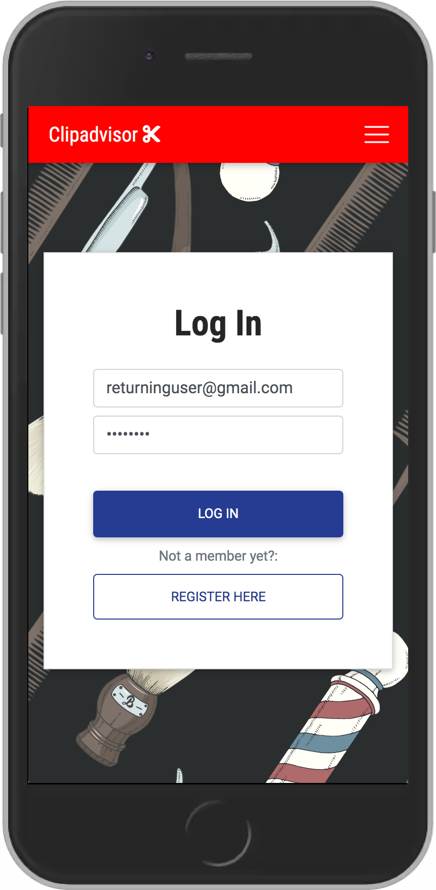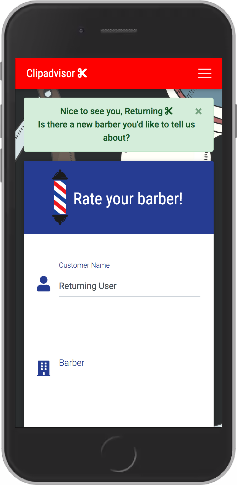

  
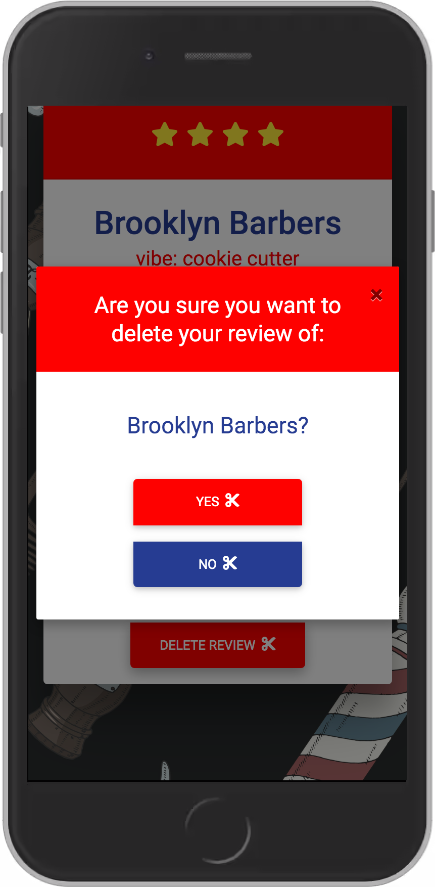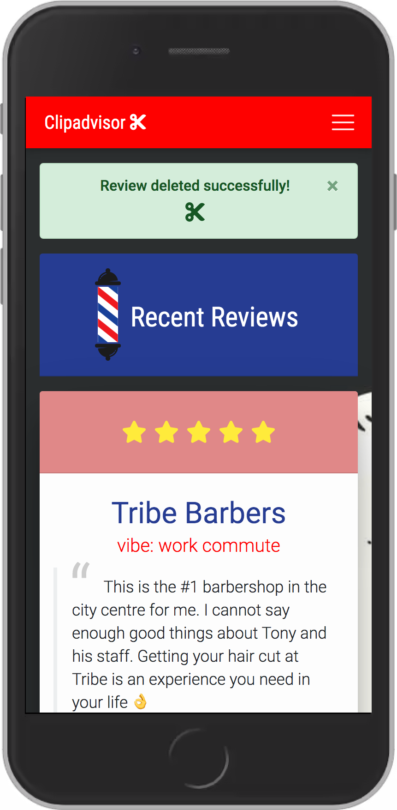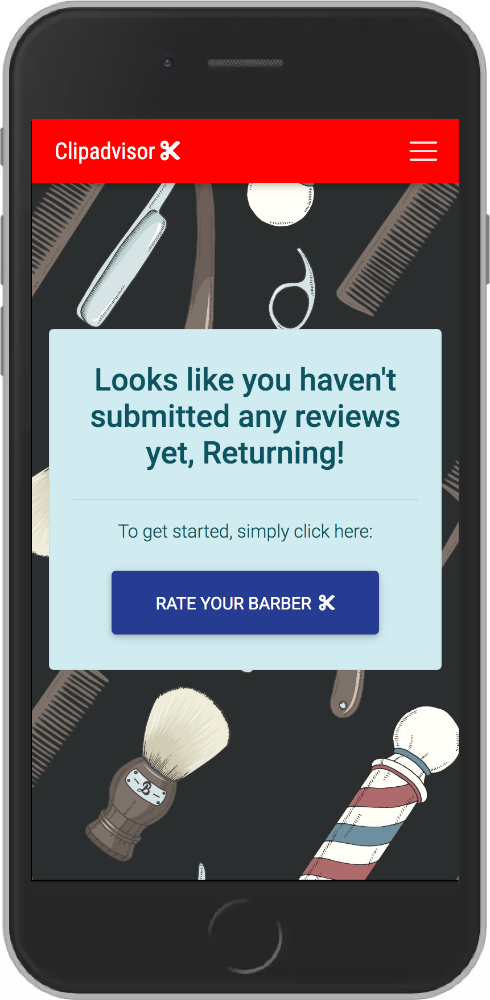

6. **"As a Clipadvisor user, I would like to be able to contact the site owner(s) with a query/feature request."**
  - "Clicking on the 'Contact' link in the main Clipadvisor navigation bar brought me to a contact page, consisting of a short form and a blue 'SEND' button.
  - The form asked me to provide my name along with my contact message; I was relieved to see that it didn't also ask me for my email address (seeing as I was already logged in to the site).
  - It took me less than a minute to fill out the contact form, at which point I clicked the 'SEND' button to submit my query.
  - This took me to a page thanking me for getting in touch and assuring me that someone from Clipadvisor would respond to me in due course.
  - Finally, after about four or five seconds this message disappeared and I was taken back to the site's Home page"

  
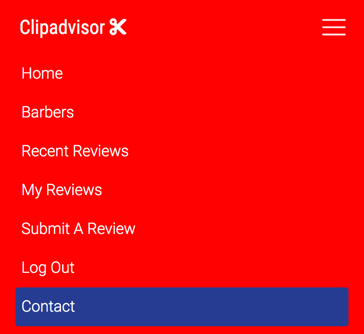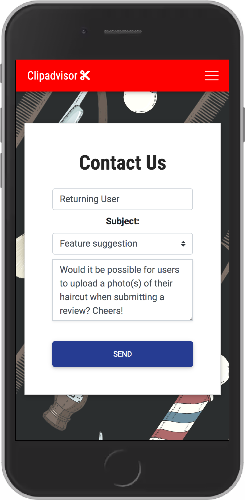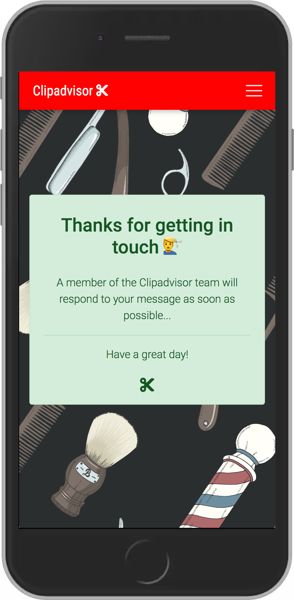

7. **"As a developer, I would like to be able to contact the site owner(s) to offer feedback on the app's functionality."**
  - "Clicking on the 'Contact' link in the main Clipadvisor navigation bar brought me to a contact page, consisting of a short form and a blue 'SEND' button.
  - Seeing as I wasn't a registered/logged-in user, the form asked me to provide my name and email address along with my contact message.
  - It took me less than a minute to fill out the contact form, at which point I clicked the 'SEND' button to submit my query.
  - This took me to a page thanking me for getting in touch and assuring me that someone from Clipadvisor would respond to me in due course.
  - Finally, after about four or five seconds this message disappeared and I was taken back to the site's Home page"

  
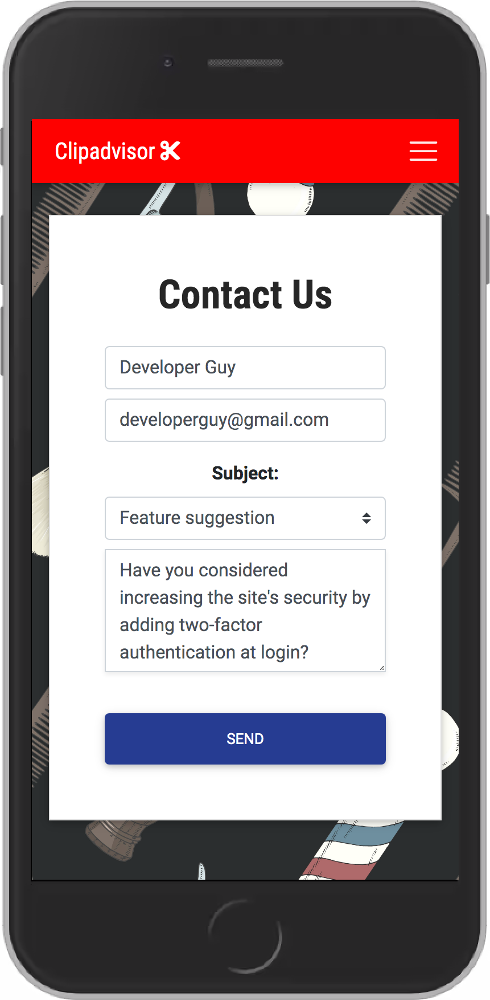

8. **"As site owner, I would like to be able to moderate all user-submitted content, i.e. have the ability to UPDATE and/or DELETE reviews where necessary."**
  - "By logging in as the 'Super Admin' user, it is possible to update and/or delete all user-submitted content.
  - All other user accounts are restricted to updating/deleting reviews submitted by themselves **only**.
  - This content moderation functionality bolsters security and ensures any malicious/inappropriate content can be updated/deleted as soon as it is detected."

  
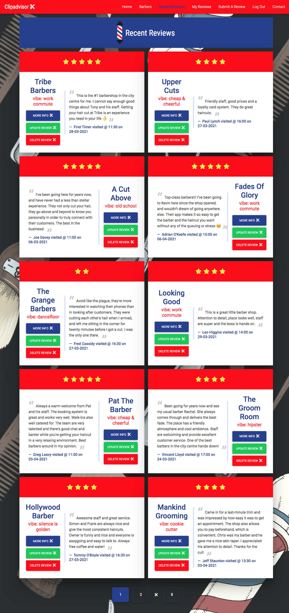

9. **"As site owner, I would like for users to be able to contact me directly, i.e. without having to leave the application."**
  - "It's both quick and easy for Clipadvisor users to contact me without having to leave the site:
    - By navigating to the 'Contact' page from the app's main nav bar, they can choose from a variety of message categories:
      - Feedback
      - General query
      - Feature suggestion
      - Report a bug/error message
    - If the user is not logged in at the time, they will be asked to provide an email address in addition to a name when they are submitting the contact form.
    - Logged-in users, on the other hand, will only be asked for their name, as their email address will be stored in the current session's cookie data.
    - Whenever a message is sent by submitting this form, I receive an email listing the message's contents. I can then respond appropriately to the message sender."

    
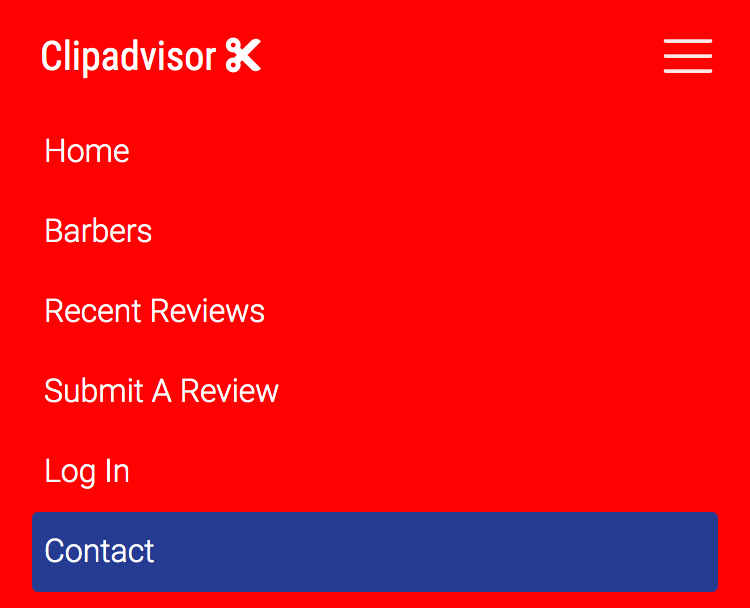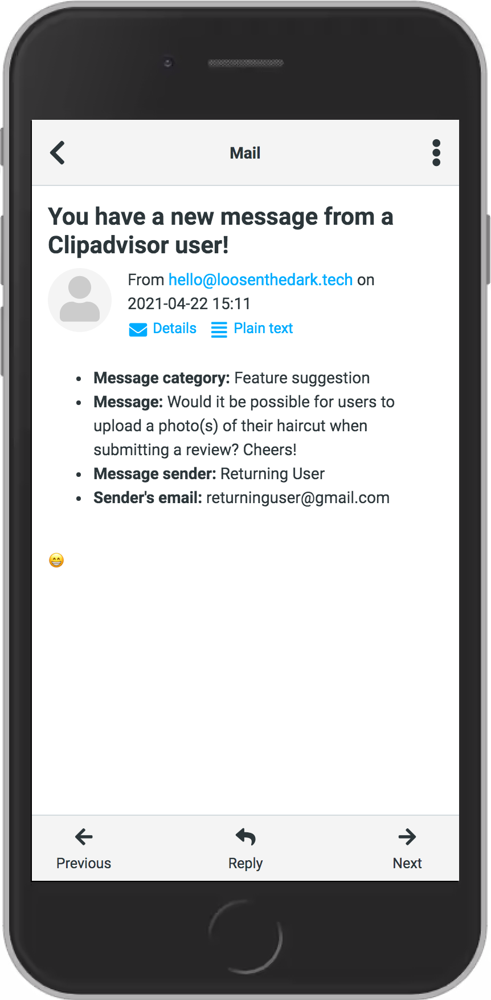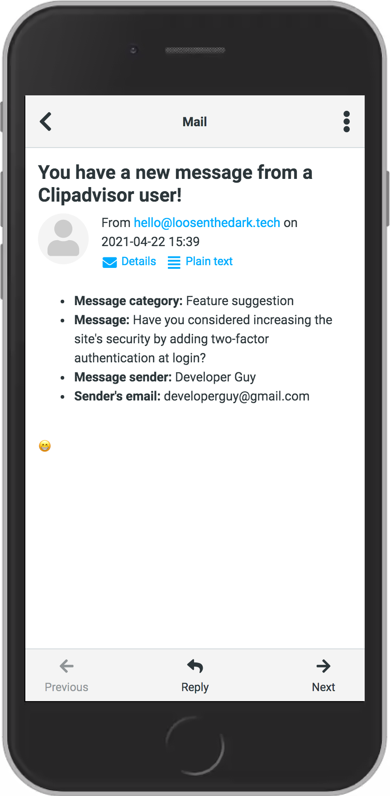

- Form Validation & Error Handling

  - There are several forms and potential sites for invalid user input/interaction throughout the site, as detailed below:

    - **Registration form**
      - All five fields are required - this was implemented by adding the `required` attribute to the relevant HTML tag in each instance
      - In most cases, incomplete or invalid user input will be intercepted by built-in client-side (browser default) HTML5 validation, resulting in a message such as that seen in the first screenshot below being relayed to the user
      - For invalid input that makes it past this "first layer" of client-side validation, a number of customised server-side checks have been put in place to respond and redirect the user as to how they might correct their input in order to successfully submit the form. The second screenshot below, for instance, shows the `.alert` message that is returned by the server if a user enters two non-identical passwords while trying to register. The third screenshot, meanwhile, shows the message that is returned when a user attempts to register using an email address that was previously used to set up another account.
      - The following is a complete list of the various format constraints and requirements placed on each of the form's `input`s:
        - `#register-form-first-name` input: must be between 2 and 50 characters in length
        - `#register-form-last-name` input: must be between 2 and 50 characters in length
        - `#register-form-email` input: must be between 6 and 100 characters in length; the `pattern` and `title` attributes have been applied to the HTML tag to guide the user in enering an acceptable email format
        - `register-form-password1` input: must be between 8 and 100 characters in length
        - `register-form-password2` input: must be between 8 and 100 characters in length, and must match what was entered in `register-form-password1`

        
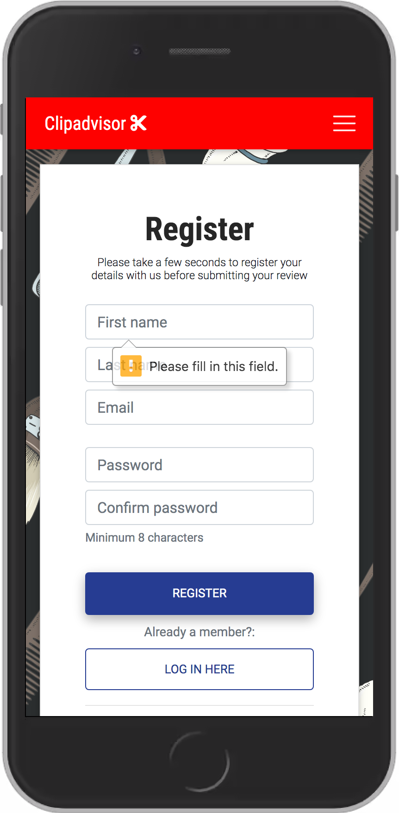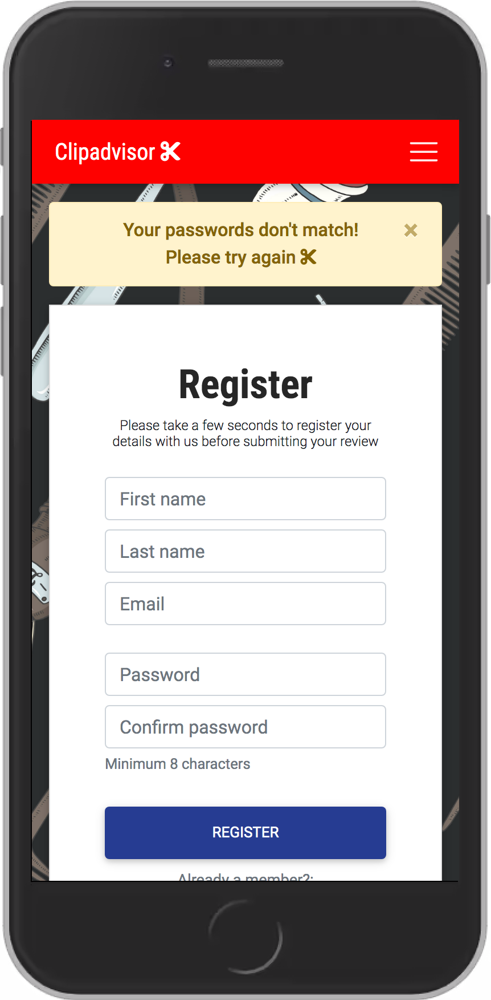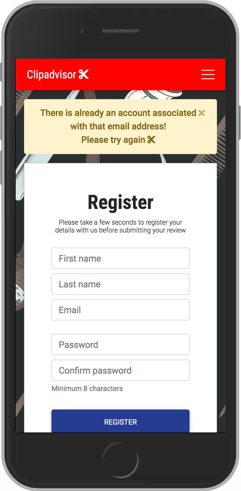

    - **Login form**
      - Both fields are required - this was once again implemented by adding the `required` attribute to the relevant HTML tag in each instance
      - The first screenshot below shows what happens when the user attempts to submit the form and log in without entering any input; they are asked to fill out both fields thanks to a browser default HTML5 validation message.
      - For invalid input that makes it past this "first layer" of client-side validation, a couple of customised server-side checks have been put in place to respond and redirect the user as to how they might correct their input in order to successfully submit the form. The second screenshot below, for instance, shows the `.alert` message that is returned by the server if a user tries to log in with an email address that isn't recognised by the database. The third screenshot, meanwhile, shows the message that is returned when a user attempts to log in with an incorrect password (this particular message is kept deliberately vague in an effort to ward off malicious brute-force login attempts).
      - The following is a complete list of the various format constraints and requirements placed on each of the form's `input`s:
        - `#login-email` input: must be between 6 and 100 characters in length; the `pattern` and `title` attributes have been applied to the HTML tag to guide the user in enering an acceptable email format
        - `login-password` input: must be between 8 and 100 characters in length

        
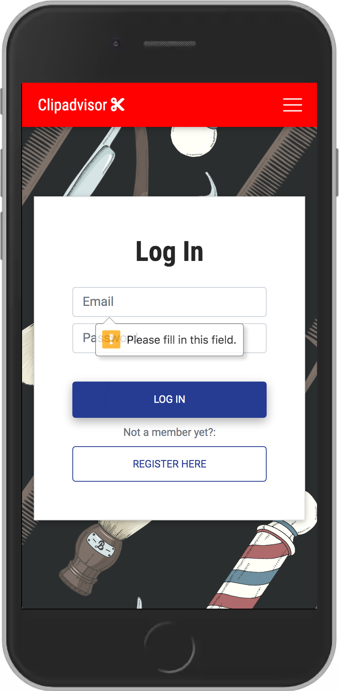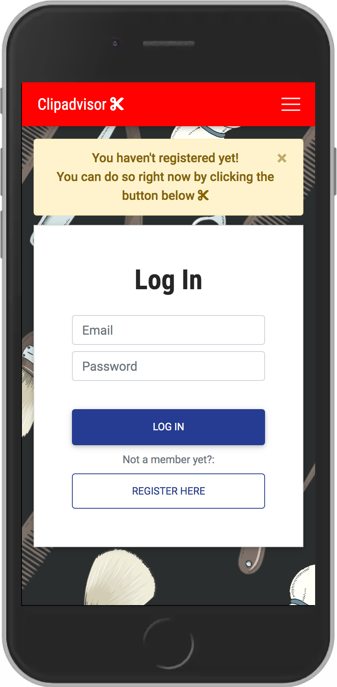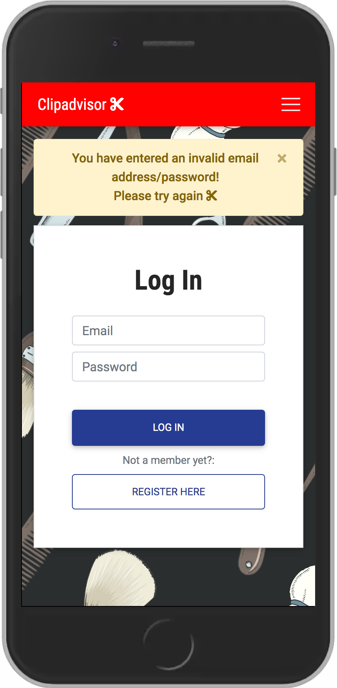

    - **Review Submit & Review Update forms**
      - These two forms are essentially identical, and so share a common validation protocol 
      - As with the registration and login forms outlined above, an initial screen against invalid/missing/malicious user input is provided in the browser before the data is submitted to the server
      - All nine separate 'fields' are again required, such that if a user attempts to submit a review leaving any of them empty they will be told to correct this via a HTML5 notfication
      - For three of these - `.booking-checkbox`, `.payment-checkbox` and `input[name="review-update-form-star-rating"]` - it was necessary to put in place client-side validation using jQuery event handling and conditional logic. The responses returned to the user by them attempting to leave each of these three fields blank are shown below.
      - On the server side, an assortment of checks have been applied that will catch the vast majority of invalid input that manages to make it past the client-side validation.
      - Besides the `required` attribute, the following is a complete list of the various format constraints and requirements placed on all applicable `input` fields across both forms:
        - `#review-submit-form-customer-name`/`#review-update-form-customer-name` input: must be between 4 and 50 characters in length
        - `#review-submit-form-barbershop-name`/`#review-update-form-barbershop-name` input: must be between 3 and 50 characters in length
        - `#review-submit-form-comments`/`#review-update-form-comments` input: must be between 10 and 1000 characters in length

        
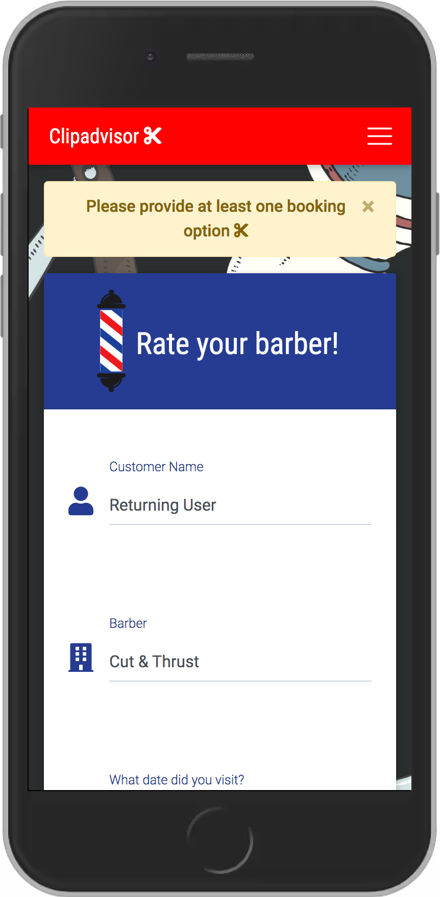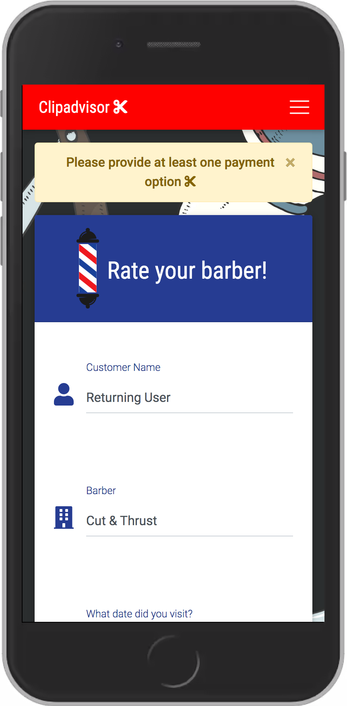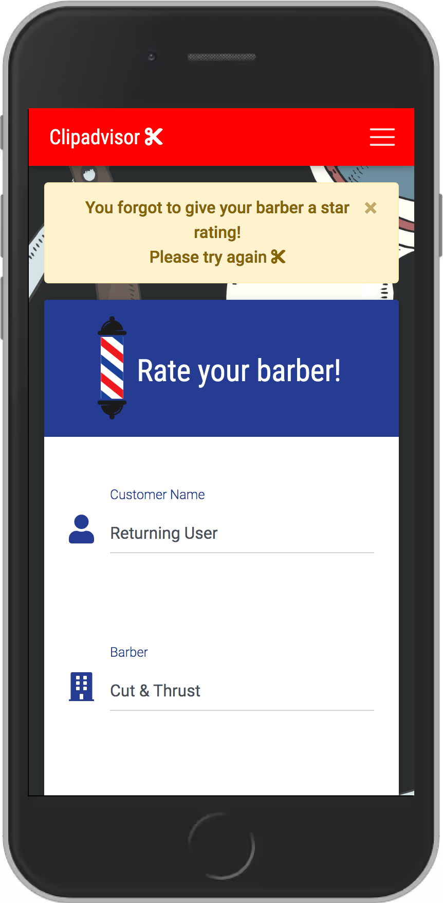

    - **Contact form**
      - All three/four fields are required - this was again implemented by adding the `required` attribute to the relevant HTML tag in each instance
      - It is worth noting that one of these - `select#contact-form-category` - has a pre-selected default value, making it impossible to submit the form with this field empty
      - The following is a complete list of the various format constraints and requirements placed on each of the form's `input`s:
        - `#contact-form-name` input: must be between 4 and 50 characters in length
        - `#contact-form-email` input: if requested, must be between 6 and 100 characters in length; the `pattern` and `title` attributes have again been applied to the HTML tag to guide the user in enering an acceptable email format
        - `#contact-form-message` input: must be between 10 and 2000 characters in length; 

        
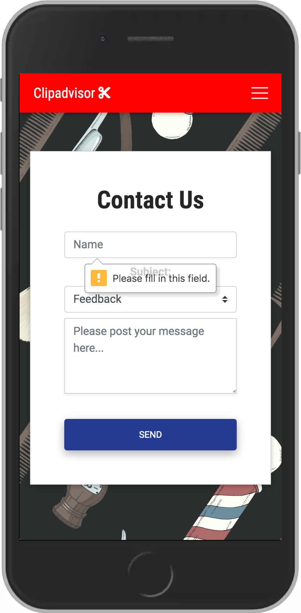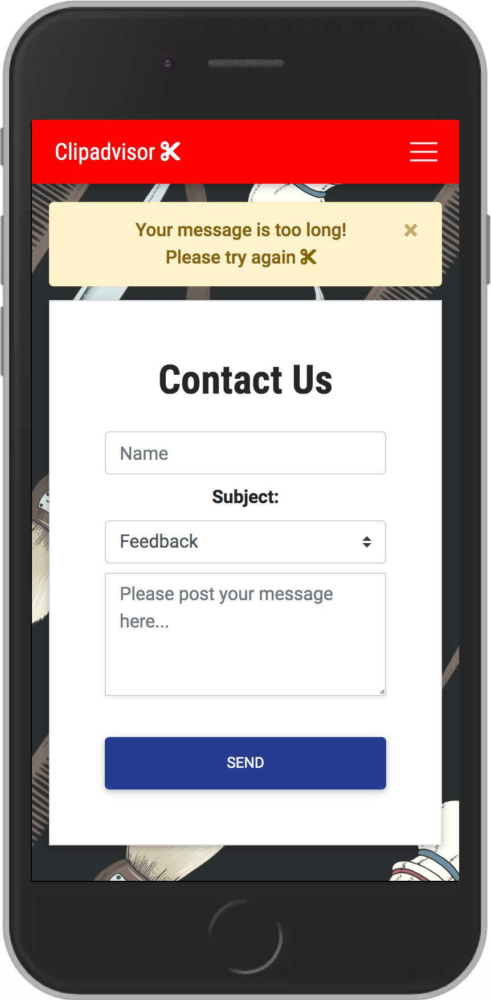

- Redirecting Errant (Logged-In) Users:

  - If a logged-in user tries for some reason to navigate to the Login or Register page (e.g. by manually entering the URL of the `/login` or `/register` route into the address bar), they will be shown a dismissible Flash message informing them they are already logged in, as well being redirected to their personalised 'My Reviews' page (even if they haven't yet submitted any reviews):

  
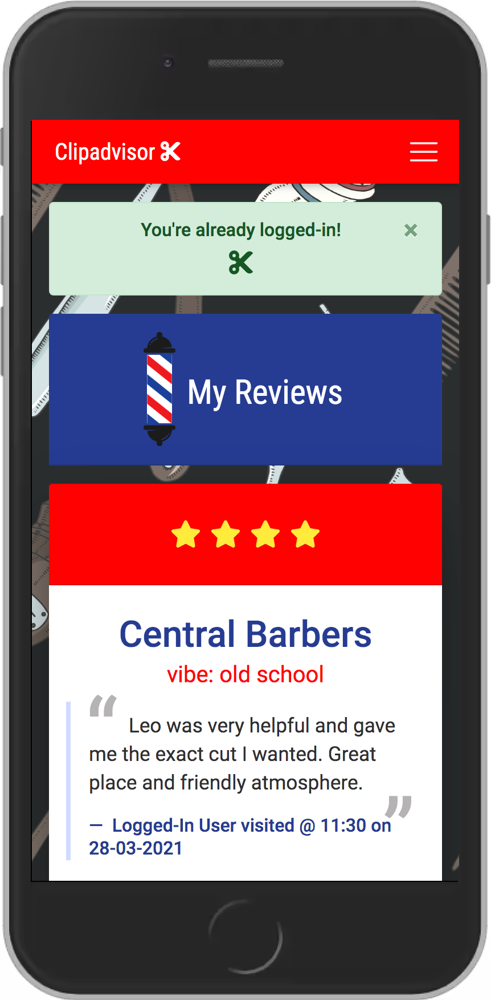

---

* [Flask + SQLAlchemy CRUD application tutorial | Parwiz Forogh on YouTube](https://www.youtube.com/watch?v=XTpLbBJTOM4)

* [Python website with database connectivity and user authentication tutorial | Tech With Tim on YouTube ](https://www.youtube.com/watch?v=dam0GPOAvVI)

* Auto-generated 'secret key' password supplied by [this key-gen tool](https://passwordsgenerator.net/)

* https://www.shutterstock.com/image-vector/barber-symbol-shop-icon-hair-service-1070505362?id=1070505362&irclickid=1jiSOcU5OxyLUmQwUx0Mo3EqUkEXh30ItXjY1M0&irgwc=1&utm_medium=Affiliate&utm_campaign=Free%20SVG&utm_source=2022575&utm_term=&c3ch=Affiliate&c3nid=IR-2022575

* A way of disabling 'false positive' error messages thrown by [Pylint](https://pypi.org/project/pylint/) in relation to the `scoped_session` class ("instance of scoped_session has no add/commit member" etc.) [found here](https://stackoverflow.com/questions/59214324/flask-error-db-scoped-session-instance-of-scoped-session-has-no-commit-mem)

* Bespoke 'page rating' code snippet used within `#review-submit-form` adapted from [this template](https://codepen.io/hesguru/pen/BaybqXv)

* `sqlalchemy.exc.NoSuchModuleError: Can't load plugin: sqlalchemy.dialects:postgres` [fix](sqlalchemy.exc.NoSuchModuleError: Can't load plugin: sqlalchemy.dialects:postgres)

* I was able to make flash messages more visually appealing by adding some basic markup (for line breaks etc.) using the [`flask.Markup` extension](https://tedboy.github.io/flask/generated/generated/flask.Markup.html) after following advice posted on [this Stack Overflow thread](https://stackoverflow.com/questions/18225713/how-to-display-html-content-through-flask-messages)

* Material Design 'block' components for Reviews page adapted from [Marta Wierzbicka's original design](https://mdbootstrap.com/snippets/jquery/marta-szymanska/1343674)

* [jQuery DateTimePicker plugin source code](https://github.com/xdan/datetimepicker)

* Users are required to supply at least one available payment method when submitting a review by means of a [jQuery validation script that has been with permission](https://www.howtocodeschool.com/2019/11/submit-form-If-at-least-one-checkbox-is-checked.html)

* After trying everything (including chatting with Igor on the Code Institute Tutor Assistance tab) right up to starting a brand new environment, and then uninstalling and reinstalling all of the package dependencies from my `requirements.txt` file (none of which resolved the issue), I finally figured out that the cause of a persistent `sqlalchemy.exc.NoSuchModuleError: Can't load plugin: sqlalchemy.dialects:postgres` error was a bug linked to how SQLAlchemy stores the dialect for the project's Database URI (environment variable). After following the advice [on this forum](https://github.com/pallets/flask-sqlalchemy/issues/929), I was eventually able to overcome this problem by modifying the DB URI dialect in my `app.py` file

* Dynamic-width Flash message alert implemented with help from [this Stack Overflow response](https://stackoverflow.com/questions/31721816/set-divs-width-equal-to-another-div); augmented by [alert resize on screen resize](https://api.jquery.com/resize/)

* Font Awesome SVG attribution [ link to licence](https://fontawesome.com/license)

* I got some help with using the appropriate Jinja syntax when trying to display reviews in descending order of recency (i.e. sorting the list returned from my database by id in reverse order) from [this Stack Overflow thread](https://stackoverflow.com/questions/1959386/how-do-you-sort-a-list-in-jinja2)

* I received pointers for generating email from contact form user input in Python from [this video tutorial](https://www.youtube.com/watch?v=JRCJ6RtE3xU)

* Customer error handling has been put in place to deal with three of the most common error codes [in keeping with best practices](https://flask.palletsprojects.com/en/1.1.x/patterns/errorpages/)

* https://stackoverflow.com/questions/17797921/jinja2-create-new-row-for-every-3-items | https://jinja.palletsprojects.com/en/2.11.x/templates/#batch